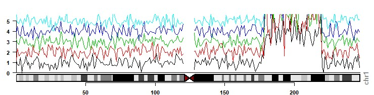

## Quick disclaimer

- R = several ways to get the same result
- Figures arent perfect
- Brief overview 

## Introduction

- karyoploteR allows you to easily *plot* data across the genome
- built upon base R (sorry Tidyverse people!)

<div class="centered">
{width=90%}
</div>

<div class="notes">
Being a  plotting package means it should *only* be used for visualization and not for any kind of analysis, but also allows users to bring in data from a variety of resources. 
</div>

## Installing karyoploteR

Current version: 

```{r, warning=FALSE, message=FALSE, eval=FALSE}
if (!requireNamespace("BiocManager", quietly = TRUE))
    install.packages("BiocManager")
  BiocManager::install("karyoploteR")
```

Developmental version can also be downloaded from github using `devtools::install_github()`

## Getting started 

```{r, warning=FALSE, message=FALSE, fig.height=4, fig.width=5, fig.align='center'}
library(karyoploteR)

kp <- plotKaryotype()

```

<div class="notes">
Default genome build is hg19. However users can specify other genomes (such as mouse or fly) and build custom genomes.  Can specify which chromosomes to use. 
</div>

## Layouts {.smaller}

- plot.type = 1 
    - data panel above ideogram
- plot.type = 2
    - two data panels one above and one below ideogram
- plot.type = 3
    - plot type 2 but arranged in a row
- plot.type = 4
    - plot type 1 but arranged in a row
- plot.type = 5
    - ideograms in a row with a data panel below
- plot.type = 6
    - no ideogram
- plot.type = 7
    - ideograms only in a row (caution!)

## Adding layers 

Base R

```{r, eval=FALSE}
kp <- plotKaryotype(chromosomes="chr17")
kpAddCytobandLabels(kp, force.all=TRUE, srt=90, col="purple", cex=1) 
```

magrittr

```{r, eval=FALSE}
library(magrittr)

kp <- plotKaryotype(chromosomes="chr17") %>% 
  kpAddCytobandLabels(force.all=TRUE, srt=90, col="purple", cex=1)
```

<div class="centered">
{width=90%}
</div>

## Basic data types

<!-- - *basic commands:*  kpAbline, kpArrows, kpBars, kpHeatmap, kpLines, kpPoints, kpPolygon, kpRect, kpSegments, kpText, ... -->

```{r, warning=FALSE, message=FALSE, echo=FALSE}

pp <- getDefaultPlotParams(plot.type = 1)
pp$data1height=600
  
tr.i <- 1/11
tr.o <- 1/10
  
kp <- plotKaryotype(chromosomes=c("chr1"), plot.params = pp) 
  
dd <- toGRanges(data.frame(chr="chr1", start=end(kp$genome[1])/50*(0:49), end=end(kp$genome[1])/50*(1:50)))
mcols(dd) <- data.frame(y=((sin(start(dd)) + rnorm(n=50, mean=0, sd=0.1))/5)+0.5)
  
tn <- 0
kpDataBackground(kp, r0=tr.o*tn, r1=tr.o*tn+tr.i)
kpPoints(kp, dd, r0=tr.o*tn, r1=tr.o*tn+tr.i, pch=".", cex=2, col=rainbow(10)[1])
kpRect(kp, chr="chr1", x0=5000000, x1=45000000, y0=0.2, y1=0.8, r0=tr.o*tn, r1=tr.o*tn+tr.i, col="#EEEEEE", border="#666666")
kpText(kp, chr="chr1", x=25000000, y=0.5, col="black", r0=tr.o*tn, r1=tr.o*tn+tr.i, labels="kpPoints", cex=0.7)
  
tn <- 1
kpDataBackground(kp, r0=tr.o*tn, r1=tr.o*tn+tr.i)
kpLines(kp, dd, r0=tr.o*tn, r1=tr.o*tn+tr.i, pch=".", cex=2, col=rainbow(10)[2])
kpRect(kp, chr="chr1", x0=5000000, x1=45000000, y0=0.2, y1=0.8, r0=tr.o*tn, r1=tr.o*tn+tr.i, col="#EEEEEE", border="#666666")
kpText(kp, chr="chr1", x=25000000, y=0.5, col="black", r0=tr.o*tn, r1=tr.o*tn+tr.i, labels="kpLines", cex=0.7)

tn <- 2
kpDataBackground(kp, r0=tr.o*tn, r1=tr.o*tn+tr.i)
kpBars(kp, dd, y1=dd$y, r0=tr.o*tn, r1=tr.o*tn+tr.i, col=rainbow(10)[3])
kpRect(kp, chr="chr1", x0=5000000, x1=45000000, y0=0.2, y1=0.8, r0=tr.o*tn, r1=tr.o*tn+tr.i, col="#EEEEEE", border="#666666")
kpText(kp, chr="chr1", x=25000000, y=0.5, col="black", r0=tr.o*tn, r1=tr.o*tn+tr.i, labels="kpBars", cex=0.7)

tn <- 3
kpDataBackground(kp, r0=tr.o*tn, r1=tr.o*tn+tr.i)
kpRect(kp, dd, y0=dd$y-0.3, y1=dd$y, r0=tr.o*tn, r1=tr.o*tn+tr.i, col=rainbow(10)[4])
kpRect(kp, chr="chr1", x0=5000000, x1=45000000, y0=0.2, y1=0.8, r0=tr.o*tn, r1=tr.o*tn+tr.i, col="#EEEEEE", border="#666666")
kpText(kp, chr="chr1", x=25000000, y=0.5, col="black", r0=tr.o*tn, r1=tr.o*tn+tr.i, labels="kpRect", cex=0.7)

tn <- 4
kpDataBackground(kp, r0=tr.o*tn, r1=tr.o*tn+tr.i)
kpText(kp, dd, labels=as.character(1:50), cex=0.5, r0=tr.o*tn, r1=tr.o*tn+tr.i, col=rainbow(10)[5])
kpRect(kp, chr="chr1", x0=5000000, x1=45000000, y0=0.2, y1=0.8, r0=tr.o*tn, r1=tr.o*tn+tr.i, col="#EEEEEE", border="#666666")
kpText(kp, chr="chr1", x=25000000, y=0.5, col="black", r0=tr.o*tn, r1=tr.o*tn+tr.i, labels="kpText", cex=0.7)

tn <- 5
kpDataBackground(kp, r0=tr.o*tn, r1=tr.o*tn+tr.i)
kpSegments(kp, dd, y0=dd$y-0.3, y1=dd$y, r0=tr.o*tn, r1=tr.o*tn+tr.i, col=rainbow(10)[6])
kpRect(kp, chr="chr1", x0=5000000, x1=45000000, y0=0.2, y1=0.8, r0=tr.o*tn, r1=tr.o*tn+tr.i, col="#EEEEEE", border="#666666")
kpText(kp, chr="chr1", x=25000000, y=0.5, col="black", r0=tr.o*tn, r1=tr.o*tn+tr.i, labels="kpSegments", cex=0.7)

tn <- 6
kpDataBackground(kp, r0=tr.o*tn, r1=tr.o*tn+tr.i)  
kpArrows(kp, dd, y0=dd$y-0.3, y1=dd$y, r0=tr.o*tn, r1=tr.o*tn+tr.i, length=0.04, col=rainbow(10)[7])
kpRect(kp, chr="chr1", x0=5000000, x1=45000000, y0=0.2, y1=0.8, r0=tr.o*tn, r1=tr.o*tn+tr.i, col="#EEEEEE", border="#666666")
kpText(kp, chr="chr1", x=25000000, y=0.5, col="black", r0=tr.o*tn, r1=tr.o*tn+tr.i, labels="kpArrows", cex=0.7)

tn <- 7
kpDataBackground(kp, r0=tr.o*tn, r1=tr.o*tn+tr.i)
kpHeatmap(kp, dd, r0=tr.o*tn+tr.i/4, r1=tr.o*tn+tr.i-tr.i/4, colors = c(rainbow(10)[8], "white"))
kpRect(kp, chr="chr1", x0=5000000, x1=45000000, y0=0.2, y1=0.8, r0=tr.o*tn, r1=tr.o*tn+tr.i, col="#EEEEEE", border="#666666")
kpText(kp, chr="chr1", x=25000000, y=0.5, col="black", r0=tr.o*tn, r1=tr.o*tn+tr.i, labels="kpHeatmap", cex=0.7)

tn <- 8
kpDataBackground(kp, r0=tr.o*tn, r1=tr.o*tn+tr.i)
kpPolygon(kp, dd, r0=tr.o*tn, r1=tr.o*tn+tr.i, col=rainbow(10)[9])
kpRect(kp, chr="chr1", x0=5000000, x1=45000000, y0=0.2, y1=0.8, r0=tr.o*tn, r1=tr.o*tn+tr.i, col="#EEEEEE", border="#666666")
kpText(kp, chr="chr1", x=25000000, y=0.5, col="black", r0=tr.o*tn, r1=tr.o*tn+tr.i, labels="kpPolygon", cex=0.7)

tn <- 9
kpDataBackground(kp, r0=tr.o*tn, r1=tr.o*tn+tr.i)
kpAbline(kp, h=c(0.25, 0.5, 0.75), v=start(dd), r0=tr.o*tn, r1=tr.o*tn+tr.i, col=rainbow(10)[10])
kpRect(kp, chr="chr1", x0=5000000, x1=45000000, y0=0.2, y1=0.8, r0=tr.o*tn, r1=tr.o*tn+tr.i, col="#EEEEEE", border="#666666")
kpText(kp, chr="chr1", x=25000000, y=0.5, col="black", r0=tr.o*tn, r1=tr.o*tn+tr.i, labels="kpAbline", cex=0.7)

```


## Adding data 

```{r, echo=FALSE, message=FALSE, warning=FALSE}
library(magrittr)
```

```{r, warning=FALSE, message=FALSE}

x <- 1:24*10e6 # genomic location
y <- runif(n = 24, min = 0, max = 1) #random values for plotting

```

```{r, warning=FALSE, message=FALSE, fig.width=7, fig.height=3, fig.align='center'}

plotKaryotype(plot.type=2, chromosomes = "chr1") %>%
  kpDataBackground(data.panel = 1, col="deepskyblue") %>%
  kpDataBackground(data.panel = 2, col="darkorange") %>%
  kpPoints(chr="chr1", x=x, y=y, data.panel = 1) %>%
  kpLines(chr="chr1", x=x, y=y, data.panel = 2) 

```

<div class="notes">
There are multiple different types of "data panels" available, which alter where the data is visualized compared to the ideogram (data panels above, below, both, chromosomes in a line or each on its own line, ...). We will focus on type 2 with panels both above and below and using only one chromosome for simplicity. 
</div>

## Data Panels 

```{r, warning=FALSE, message=FALSE, fig.width=6, fig.align='center', fig.height=3}
plotKaryotype(plot.type=1, chromosomes = "chr1") %>%
  kpDataBackground(data.panel = 1, col="deepskyblue") %>%
  kpPoints(chr="chr1", x=x, y=y, data.panel = 1) %>%
  kpRect(chr="chr1", x0=20e6, x1=50e6, y0=0, y1=1, col="#AAFFCBDD", 
         data.panel="ideogram", border=NA) %>%
  kpRect(chr="chr1", x0=75e6, x1=95e6, y0=0, y1=1, col="#AAFFCBDD",
         data.panel="all", border=NA)

```

## Adding plot features

```{r, warning=FALSE, message=FALSE, fig.align='center', fig.width=7.5, fig.height=3}

plotKaryotype(chromosomes="chr17", plot.type = 1) %>% 
  kpDataBackground(data.panel = 1, col="deepskyblue") %>%
  kpAddCytobandLabels(force.all=TRUE, srt=90, col="purple", cex=0.5) %>%
  kpAddBaseNumbers() %>%
  kpAddLabels(labels="Data", data.panel = 1, col="green") %>%
  kpAxis(data.panel=1, side=2)

```

## Viewing plotting parameters

```{r, warning=FALSE, message=FALSE, fig.align='center', fig.width=7, fig.height=5}

plotDefaultPlotParams(plot.type=1)

```

## Changing plotting parameters

```{r, warning=FALSE, message=FALSE, fig.align='center', fig.width=7, fig.height=3}

pp <- getDefaultPlotParams(plot.type=1)
pp$ideogramheight <- 100 ; pp$data1height <- 100
plotKaryotype(chromosomes="chr1", plot.type=2, plot.params = pp) %>%
  kpDataBackground(color = "deepskyblue")

```

# karyoploteR specific commands

## Gene markers

```{r, warning=FALSE, message=FALSE, fig.align='center', fig.width=6, fig.height=3, echo=FALSE}

markers <- data.frame(chr=rep("chr1", 5),
                      pos=(1:5*1e6), 
                      labels=paste0("Gene", 1:5))

```

```{r, warning=FALSE, message=FALSE, fig.align='center', fig.width=7, fig.height=3}

plotKaryotype(chromosomes="chr1") %>%
  kpAddBaseNumbers() %>%
  kpPlotMarkers(chr=markers$chr, x=markers$pos, labels=markers$labels,
              text.orientation = "horizontal", 
              marker.parts = c(0.5, 0.9, 0.1),line.color = "green",
              label.color = "black",  label.dist = 0.01, 
              max.iter = 1000)

```

## Linking regions 

```{r, warning=FALSE, message=FALSE, echo=FALSE}

set.seed(230)
chr <- paste0("chr",sample(1:22,size=20, replace=TRUE))
positions <- sample(1:8*10e6, size=20, replace=TRUE)

start.regs <- toGRanges(data.frame(chr[1:10],positions[1:10], positions[1:10]+10e6))
end.regs <- toGRanges(data.frame(chr[11:20],positions[11:20], positions[11:20]+10e6))

```

```{r, warning=FALSE, message=FALSE}

plotKaryotype() %>%
kpPlotLinks(data=start.regs, data2=end.regs, col="#fac7ffaa")

```

# Examples

## Lollipop Plot 

```{r, warning=FALSE, message=FALSE,fig.align='center', fig.width=7, fig.height=3}

plotKaryotype(plot.type=1, chromosomes = "chr1") %>%
  kpPoints(chr="chr1", x=x, y=y, col=rainbow(length(x)), cex=2) %>%
  kpSegments(chr="chr1", x0=x, x1=x, y0=0, y1=y,
             col=rainbow(length(x))) %>%
  kpAxis(side=2, cex=0.7) %>%
  kpAddLabels("Measure X", srt=90, r0=0.5)

```

## 5C

```{r, warning=FALSE, message=FALSE, echo=FALSE}

chr <- rep("chr1",10)
positions <- sample(1:24*10e6, size=20, replace=TRUE)

start.regs <- toGRanges(data.frame(chr,positions[1:10], positions[1:10]))
end.regs <- toGRanges(data.frame(chr,positions[11:20], positions[11:20]))


```

```{r, warning=FALSE, message=FALSE}

plotKaryotype(chromosomes = "chr1") %>%
kpPlotLinks(data=start.regs, data2=end.regs, border="purple")

```

## Nucleotide coverage

```{r, warning=FALSE, message=FALSE, echo=FALSE}

chr <- rep("chr1",23)
positions <- 1:23*10e6

tmp <- data.frame(chr, 
                  start = positions, 
                  end = positions+10e6,
                  A = NA, T = NA, C = NA, G = NA)
for(i in 1:23){
  z <- runif(4)
  z <- z/sum(z)
  tmp[i,4:7] <- z
}

tmp$T <- tmp$A + tmp$T
tmp$C <- tmp$T + tmp$C
tmp$G <- 1

tmp <- toGRanges(tmp)

```

```{r, warning=FALSE, message=FALSE, fig.align='center', fig.height=3, fig.width=7}

plotKaryotype(chromosomes = "chr1") %>%
  kpPlotRibbon(data=tmp, y0=0, y1=tmp$A, col="deepskyblue") %>%
  kpPlotRibbon(data=tmp, y0=tmp$A, y1=tmp$T, col="blue") %>%
  kpPlotRibbon(data=tmp, y0=tmp$T, y1=tmp$C, col="darkblue") %>%
  kpPlotRibbon(data=tmp, y0=tmp$C, y1=tmp$G, col="purple") %>%
  kpAddLabels(r0 = 0, r1=tmp$A[1], labels = "A") %>%
  kpAddLabels(r0 = tmp$A[1], r1=tmp$T[1], labels = "T") %>%
  kpAddLabels(r0 = tmp$T[1], r1=tmp$C[1], labels = "C") %>%
  kpAddLabels(r0 = tmp$C[1], r1=tmp$G[1], labels = "G")


```

# Other ideogram options

## ggbio

```{r, warning=FALSE, message=FALSE, fig.align='center', fig.width=7, fig.height=3}

library(ggbio)
p.ideo <- Ideogram(genome = "hg19", subchr = "chr1")

track1 <- ggplot() + geom_blank()

tracks(CHR = p.ideo, TRACK = track1)

```

## IdeoViz

```{r, warning=FALSE, message=FALSE, fig.align='center', fig.width=5, fig.height=2, eval=FALSE}

library(IdeoViz)
data(binned_multiSeries)
data(hg18_ideo)
plotOnIdeo(chrom=seqlevels(binned_multiSeries),
           ideoTable=hg18_ideo,
           values_GR=binned_multiSeries, 
           value_cols=colnames(mcols(binned_multiSeries)),
           col=1:5)

```



## Additional resources

- [bioconductor vignettes](https://bioconductor.org/packages/release/bioc/vignettes/karyoploteR/inst/doc/karyoploteR.html)
- [github tutorial](https://bernatgel.github.io/karyoploter_tutorial/)

## {data-background=figures/r_meetup.png data-background-size="600px 600px"}
